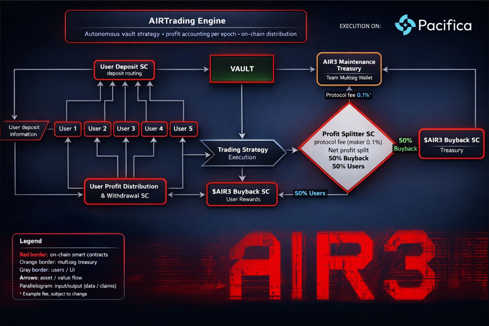

# Quickstart

## Who this documentation is for

This documentation is for:
- AIR3 users
- AIRdApp users
- community managers interested in AIRTool / AIRSponsor
- token holders following AIR3 utility expansion
- contributors and technical readers reviewing AIRTrading vault logic

## What to read first

If you are a user:
1. [Products Overview](../products/overview.md)
2. [AIRTrack (Tracking & Simulation)](../products/airtrack.md)
3. [AIRTrading (Execution Layer)](../products/airtrading.md)
4. [AIR3 Utility Flywheel](../token/utility-flywheel.md)

If you are reviewing the protocol logic:
1. [Protocol Overview](../protocol/overview.md)
2. [Vault Model](../protocol/vault-model.md)
3. [Withdraw Flow (7d Delay)](../protocol/withdraw-flow.md)
4. [Seasons & Epochs](../protocol/seasons-and-epochs.md)
5. [Risk Management & Mass Exit Scenarios](../protocol/risk-management.md)

## Current documentation scope

This docs version consolidates:
- AIR3 / AIRewardrop site messaging
- AIRdApp product modules visible in the UI
- AIRTrading Engine vault logic discussed in the protocol design
- AIRTrack simulation-vs-execution boundaries
- Pacifica execution venue integration notes

## Visual references used in this docs set

### AIRTrading Engine architecture

*Figure: AIRTrading Engine high-level flow showing vault routing, strategy execution, profit splitting, and AIR3 buyback/user reward distribution.*

### AIRdApp interface (home)

*Figure: AIRdApp home interface showing the unified entry point for AIR3 modules and community access links.*

### AIRTrack dashboard

*Figure: AIRTrack dashboard showing live tracking, chart context, and simulated trade records used for strategy validation.*
