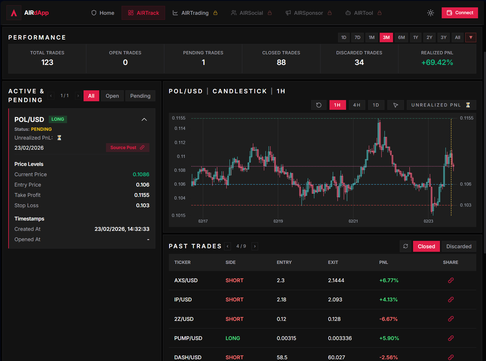

# AIRTrack

AIRTrack is the **live tracking, simulation, and strategy validation layer** of the AIR ecosystem.

It is designed to test strategies in a live environment using real market data and social momentum signals, while keeping execution separated from the production trading layer.

## What AIRTrack is

AIRTrack is:

- a **tracking platform**
- a **simulation layer**
- a **strategy validation layer**
- a **PnL monitoring and logging interface**

AIRTrack is **not** the real trade execution environment.

## What AIRTrack does

AIRTrack monitors strategy behavior and records every simulated position lifecycle, including:

- entry signal generation
- simulated position opening
- target and stop levels
- live PnL tracking
- position closure and outcome logging
- historical performance review across time windows

*Figure: AIRTrack dashboard showing live tracking, chart context, and simulated trade records used for strategy validation.*

*AIRTrack dashboard example showing active/pending trades, chart context, and historical trade records.*

## Signal source and testing scope

AIRTrack is built to cover a wide ticker universe by using market activity and social trend inputs, including the most mentioned and most accelerated tickers verified by the AIR agent on X.

The goal is not only to display trades, but to validate how strategy rules behave across changing conditions before any strategy is considered for real execution.

## Strategy progression to AIRTrading

AIRTrack and AIRTrading are connected by a validation gate.

**Workflow**
1. Strategy idea and rule set are defined
2. Strategy runs in AIRTrack live tracking/simulation
3. Results are reviewed over live conditions
4. Strategy is promoted to AIRTrading only after passing validation criteria

This product separation is a core trust and risk-control feature of the AIR ecosystem.

## Rule-based risk logic in AIRTrack simulations

AIRTrack simulations may include rule-based TP/SL management, including dynamic stop tightening as price approaches the target. This allows live observation of strategy behavior under consistent rules before deployment decisions are made.

## Transparency role

AIRTrack supports public verifiability by providing a readable history of tracked trades and outcomes that can be cross-referenced with social trade posts and broader AIRdApp views.
